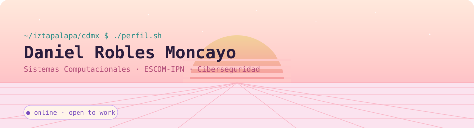
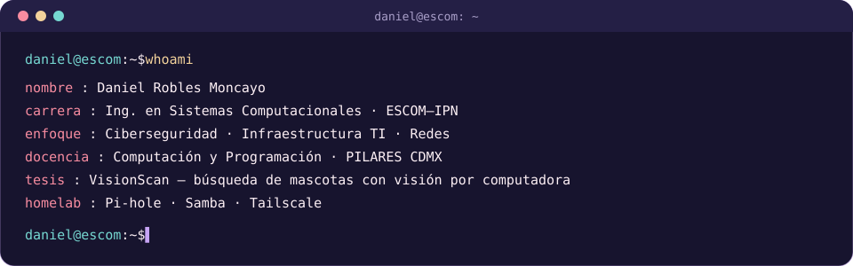

<!-- BANNER CITY-POP (se adapta a modo claro / oscuro) -->
<a href="https://github.com/TU_USUARIO">
  <picture>
    <source media="(prefers-color-scheme: dark)" srcset="assets/banner-dark.svg">
    <source media="(prefers-color-scheme: light)" srcset="assets/banner-light.svg">
    
  </picture>
</a>

 

---

## `$ whoami`

  

---

<!-- MAPA VISUAL: solo íconos de lenguajes y aplicaciones -->
## `$ nmap -sV --stack daniel.local`

<code>Starting scan… 6 hosts up · servicios detectados:</code>

  

<table>
  <tr>
    <td align="center" width="33%">
      <code>[ 10.0.0.1 ] lenguajes</code>  
       
       
      <code>Python · Java · C · C++ · JS · HTML · CSS · PHP</code>
    </td>
    <td align="center" width="33%">
      <code>[ 10.0.0.2 ] seguridad_redes</code>  
       
      &nbsp;
      &nbsp;
       
      <code>Kali · Linux · Bash · Wireshark · TryHackMe · Cisco</code>
    </td>
    <td align="center" width="33%">
      <code>[ 10.0.0.3 ] datos_ia</code>  
       
      <code>PostgreSQL + pgvector · MySQL · TensorFlow</code>
    </td>
  </tr>
  <tr>
    <td align="center">
      <code>[ 10.0.0.4 ] homelab</code>  
       
      &nbsp;
       
      <code>Ubuntu · Docker · Pi-hole · Tailscale · Samba</code>
    </td>
    <td align="center">
      <code>[ 10.0.0.5 ] creativo_3d</code>  
       
      <code>Blender · Figma</code>
    </td>
    <td align="center">
      <code>[ 10.0.0.6 ] herramientas</code>  
       
      <code>VS Code · Git · GitHub · Windows</code>
    </td>
  </tr>
</table>

<code>Scan done: 6 hosts, 0 caras detectadas, solo stack · status: learning++</code>

---

## `$ ls ~/proyectos`

| Proyecto | Descripción |
|---|---|
| 🐾 **VisionScan** | Plataforma web de adopción y búsqueda de perros extraviados con reconocimiento de imágenes (EfficientNetB0 + pgvector). Trabajo Terminal, ESCOM–IPN. |
| 🖥️ **Homelab** | Servidor personal reciclado de una All-in-One: Pi-hole, archivos compartidos con Samba y acceso remoto con Tailscale. |
| 📚 **Material PILARES** | Guías y temarios para enseñar computación y programación a personas adultas mayores y grupos comunitarios. |

---

## `$ connect --socials`

&nbsp;&nbsp;
&nbsp;&nbsp;

 

Hecho con 💖 y mucho café desde Iztapalapa, CDMX 🇲🇽

